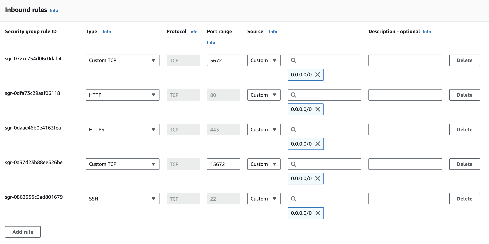
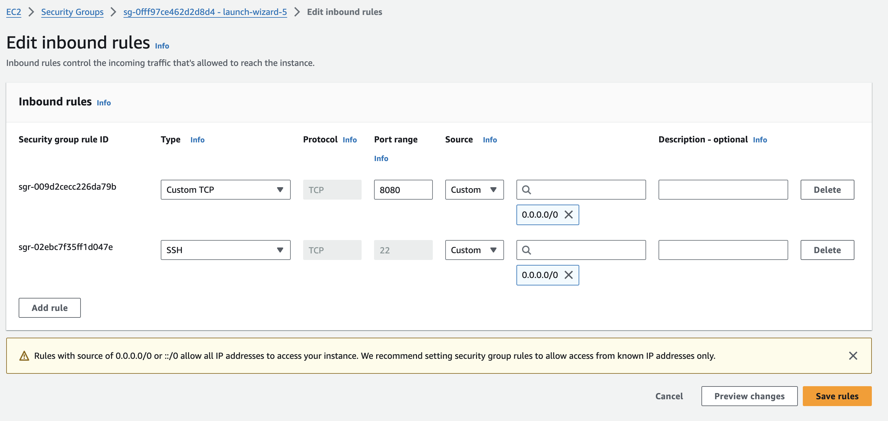
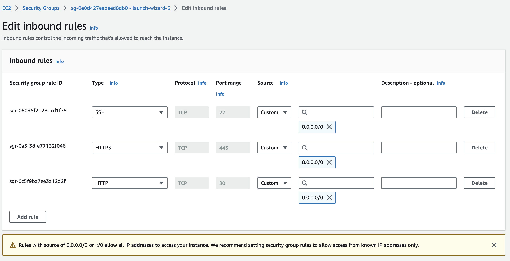

# AWS Setup

# Project setup

Start 3 Ubuntu EC2 instances, named:

1. RabbitMQ
2. Manager 
3. Worker

Recommended: Note that the code automatically assumes that the names of these instances are exactly “RabbitMQ”, “Manager”, and “Worker”, so we don’t have to hardcode IP addresses / instance IDs in case they change.

# RabbitMQ Instance setup

Connect to the EC2 instance through SSH or EC2 instance connect.

Run the following commands to install RabbitMQ on the ubuntu instance:

```
sudo apt update
sudo apt install rabbitmq-server
sudo systemctl status rabbitmq-server
sudo systemctl start rabbitmq-server
sudo systemctl enable rabbitmq-server
```

Run the following commands to create new user in RabbitMQ CLI with a username and password, which helps you access the Web Console on `http://<RABBITMQ_INSTANCE_PUBLIC_IP_ADDRESS>:15672`.

```
sudo rabbitmqctl add_user test password

sudo rabbitmqctl set_user_tags test administrator

sudo rabbitmqctl set_permissions -p / test ".*" ".*" ".*"
```

(username: test, password: password)

Note that the rabbitMQ endpoint for the other EC2 instances will be `<RABBITMQ_INSTANCE_PUBLIC_IP_ADDRESS>:5672`.

## Security Group Configuration



# Manager Instance Setup

Connect to the EC2 instance through SSH or EC2 instance connect.

Run the following commands to pull the image from DockerHub on the ubuntu instance:

```
sudo apt update
sudo apt install [docker.io](http://docker.io/)
sudo systemctl start docker
sudo groupadd docker
sudo usermod -aG docker ubuntu
sudo chmod 666 /var/run/docker.sock
sudo systemctl enable docker

git clone https://github.com/itsKarad/cs230_project
cd cs230_project/manager
docker build .

docker run -p 8080:8080 -d akarad158/cs230_manager:prod
```

Run this command to see the IMAGE_ID of the newly created container.

```
docker images
```

Use this ID to start a container by running this command:

```
docker run -d -p 8080:8080 IMAGE_ID
```

## Security Group Configuration


# Worker Instance Setup

Connect to the EC2 instance through SSH or EC2 instance connect.

Run the following commands to clone the codebase from Github on the ubuntu instance:

```
sudo apt update
sudo apt install [docker.io](http://docker.io/)
sudo systemctl start docker
sudo groupadd docker
sudo usermod -aG docker ubuntu
sudo chmod 666 /var/run/docker.sock
sudo systemctl enable docker

git clone https://github.com/itsKarad/cs230_project
cd cs230_project/worker
docker build .

docker run -p 8080:8080 -d akarad158/cs230_manager:prod
```

Run this command to see the IMAGE_ID of the newly created container.

```
docker images
```

Use this IMAGE_ID to create a tag for this image:

```
docker tag cs230_worker:prod <IMAGE_ID>
```

Use this tag to start a container by running this command:

```
docker run -d -p 8080:8080 cs230_worker:prod
```

## Security Group Configuration



# Interacting with this project

You can view realtime logs of a container by running `docker logs -f <CONTAINER_ID>`.

Find the public address of manager instance `<MANAGER_PUBLIC_ADDRESS>`.

Import the following Insomnia [JSON file](./assets/API_Insomnia.json) into your [Insomnia application](https://insomnia.rest/download).

You will find a variable URL being used for each request. Replace `PUBLIC_IP_ADDR` part of the URL variable by `<MANAGER_PUBLIC_ADDRESS>`.

Now you can interact with each of the 3 API endpoints (/ping, /load, and /order).

`/load` → a GET request that should be executed at start of every day to delete past work orders, load inventory database with ingredients.

`/order` → a POST request to place an order.

`/ping` → Testing endpoint as a healthcheck for the application.